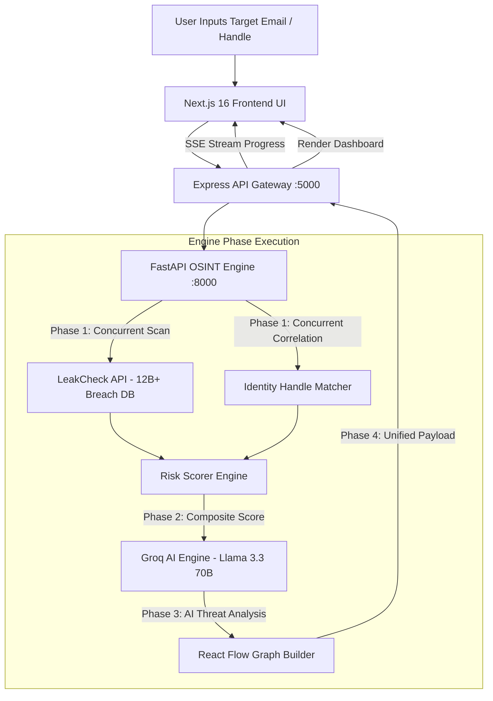

# 🛡️ TraceGuard 2.0 — AI-Powered OSINT & Privacy Footprint Analyzer

[](https://nextjs.org/)
[](https://fastapi.tiangolo.com/)
[](https://expressjs.com/)
[](https://groq.com/)
[](https://tailwindcss.com/)
[](LICENSE)

> **Know Your Digital Footprint.** An elite full-stack cybersecurity platform combining Open-Source Intelligence (OSINT), real-time data breach indexing, interactive node-edge graph visualization, and Groq-powered AI threat intelligence.

---


---

## 🌟 Key Features

* **🔍 Real-Time Data Breach Indexing**: Queries 12+ billion leaked credentials via LeakCheck APIs to identify exposed passwords, phone numbers, and physical addresses.
* **🤖 Ultra-Fast AI Threat Intelligence**: Powered by **Groq (Llama 3.3 70B Versatile)** running sub-1.5s inference to synthesize real-world attack vectors (*Credential Stuffing*, *Spear Phishing*, *SIM Swapping*).
* **🕸️ Interactive React Flow Exposure Map**: Visualizes identity connections using dynamic radial node-edge graphs with custom glowing severity indicators.
* **🧮 0–100 Methodology-Backed Risk Scoring**: Evaluates footprint severity using weighted mathematical scoring (35% breach, 25% PII, 20% web mentions, 10% correlation, 10% confidence).
* **🔒 Zero-Storage Architecture**: Client scan findings remain in-memory with automatic 60-minute TTL garbage collection. Zero data is persisted to disk or external databases.
* **📑 Branded PDF & JSON Export**: One-click generation of professional executive threat reports rendered directly in the browser via `jsPDF`.
* **🌓 Dual Light & Dark Theme Support**: Features persistent Cyberpunk Navy (Dark) and Cyber-Slate (Light) themes with system preferences memory.

---

## 🏗️ System Architecture & Data Flow



---

## 🛠️ Technology Stack

| Component | Framework / Library | Primary Purpose |
| :--- | :--- | :--- |
| **Frontend UI** | **Next.js 16 (App Router)** | Client SSR/SSG framework with React 19 |
| **Styling & Theme** | **Tailwind CSS v4 + Framer Motion** | Glassmorphism design system & micro-animations |
| **Graph Canvas** | **React Flow (`@xyflow/react`)** | Interactive drag/zoom node-edge visualizer |
| **Analytics Charts** | **Recharts + Lucide Icons** | Risk breakdown donuts, bar charts, and radar graphs |
| **Report Export** | **jsPDF** | Client-side branded executive PDF generation |
| **Backend Gateway** | **Express.js (TypeScript)** | API gateway, rate-limiting, SSE progress streaming |
| **OSINT Engine** | **Python 3.12 + FastAPI** | High-concurrency async OSINT scanner & graph layout engine |
| **AI Inference** | **Groq LPU (Llama 3.3 70B)** | Sub-1.5s AI threat vector & remediation generation |
| **Breach Intelligence**| **LeakCheck.io Public API** | 12B+ leaked credential database lookups |

---

## 🚀 Quick Start & Execution Guide (A to Z)

Follow these simple steps to clone and run **TraceGuard 2.0** on your local machine.

### Prerequisites

Ensure you have installed:
* **Node.js**: v18.0.0 or higher ([Download Node.js](https://nodejs.org/))
* **Python**: v3.10 or higher ([Download Python](https://www.python.org/))
* **Git**: Installed on your system

---

### Step 1: Clone the Repository

```bash
git clone https://github.com/YOUR_USERNAME/traceguard.git
cd traceguard
```

---

### Step 2: Set Up Environment Variables

1. Copy `.env.example` in `python-engine/` to create `.env`:
   ```bash
   cd python-engine
   cp .env.example .env
   ```

2. Open `python-engine/.env` and insert your **free Groq API Key**:
   ```env
   AI_PROVIDER=groq
   GROQ_API_KEY=gsk_your_groq_api_key_here
   LEAKCHECK_API_KEY=your_optional_leakcheck_key
   USE_MOCK_DATA=false
   ```
   > 💡 **Tip**: Get a free Groq API key in 30 seconds at [console.groq.com](https://console.groq.com).

---

### Step 3: Install & Start Python OSINT Engine (Terminal 1)

```bash
cd python-engine

# Create & activate virtual environment (optional)
python -m venv venv
# On Windows:
venv\Scripts\activate
# On macOS/Linux:
source venv/bin/activate

# Install dependencies
pip install -r requirements.txt

# Start FastAPI Engine (Runs on port 8000)
uvicorn main:app --host 0.0.0.0 --port 8000 --reload
```

---

### Step 4: Install & Start Express Backend (Terminal 2)

```bash
cd backend

# Install dependencies
npm install

# Start Express Backend Gateway (Runs on port 5000)
npm run dev
```

---

### Step 5: Install & Start Next.js Frontend (Terminal 3)

```bash
cd frontend

# Install dependencies
npm install

# Start Next.js Development Server (Runs on port 3000)
npm run dev
```

---

### Step 6: Open the App

Open your browser and navigate to:
👉 **`http://localhost:3000`**

Enter any email address (e.g. `yourname@gmail.com`) to generate your full AI OSINT Threat & Exposure Report!

---

## 🌐 1-Click Deployment on Render

This repository includes a pre-configured [`render.yaml`](render.yaml) Blueprint file for 1-click deployment:

1. Push your repository to GitHub.
2. Log in to [Render.com](https://render.com) and click **New +** → **Blueprint**.
3. Select your GitHub repository. Render will automatically detect and configure all 3 microservices (`python-engine`, `backend`, `frontend`).
4. Enter your `GROQ_API_KEY` when prompted and click **Apply**!

---

## 🔒 Privacy & Security Guarantee

* **Zero Persistent Storage**: TraceGuard never writes scan inputs, passwords, or findings to a database or disk.
* **In-Memory TTL**: Scan findings exist purely in-memory and are automatically purged after 60 minutes.
* **Local Report Processing**: PDF reports are rendered strictly inside your web browser.

---

## 📜 License

Distributed under the **MIT License**. See `LICENSE` for more information.
